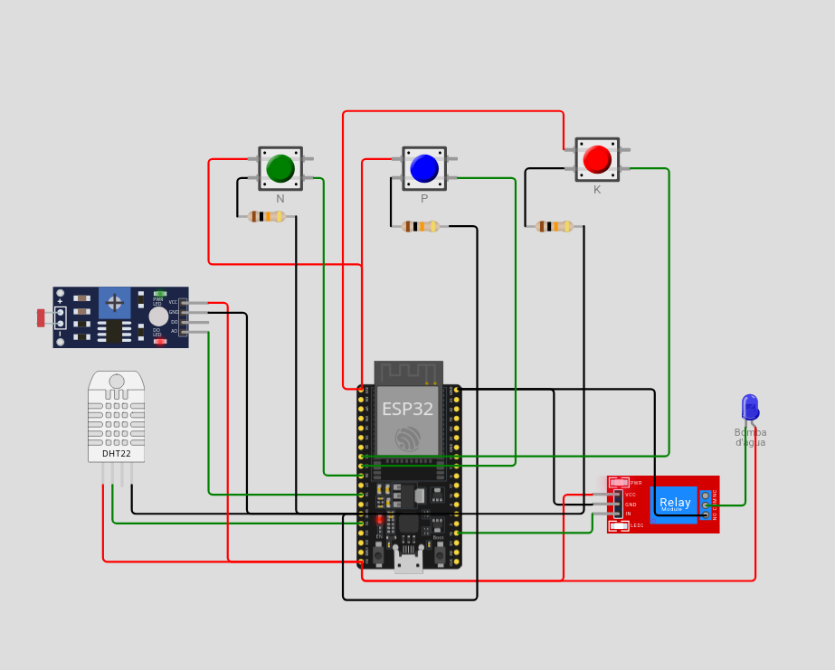

# 🌱 FarmTech Solutions – Fase 2

## 🚀 Introdução
Sistema de irrigação inteligente com ESP32, desenvolvido na Fase 2 do projeto FarmTech Solutions, simulando sensores de NPK, pH e umidade do solo no Wokwi.

## 🧩 Componentes Utilizados
- ESP32
- 3 Botões (N, P, K)
- LDR (pH)
- DHT22 (umidade)
- Relé (bomba d’água)

## ⚙️ Diagrama do Circuito

## 🧠 Lógica de Funcionamento
A irrigação é acionada automaticamente quando a umidade está abaixo de 40%, o pH está neutro e os níveis de nutrientes estão adequados.

## 🎥 Vídeo de Demonstração
[Assista no YouTube](https://youtu.be/HWMqe39e738)
